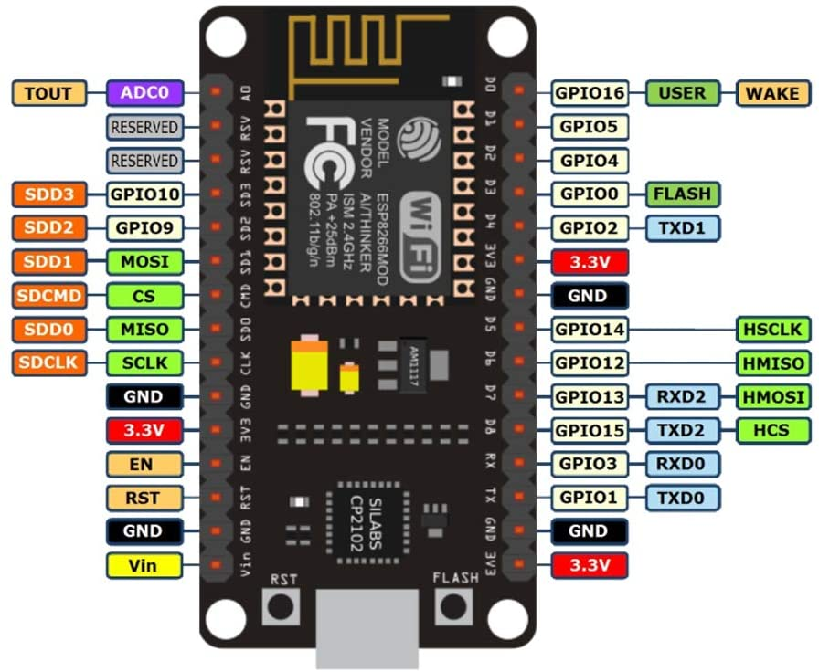
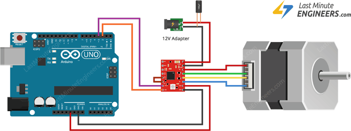
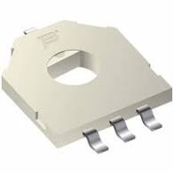
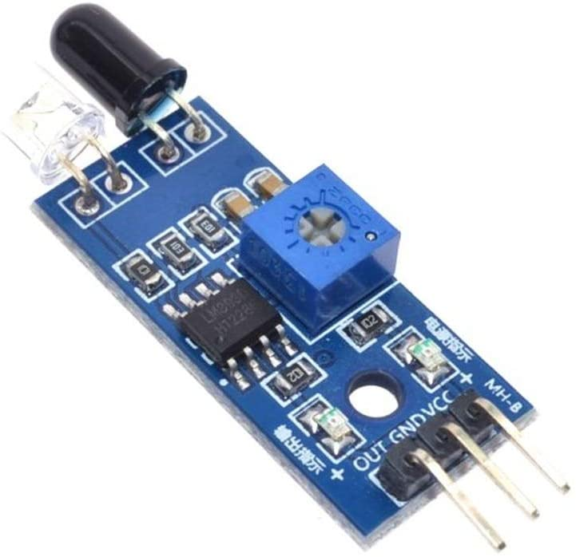
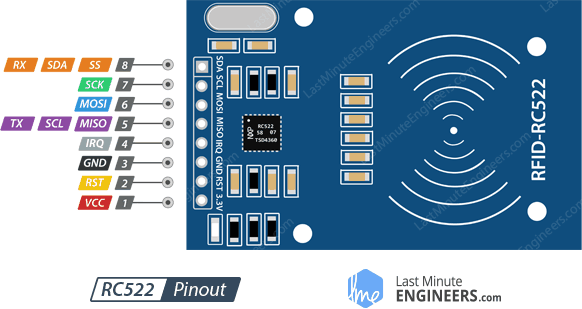

# Hardware Choices

## Overview

We need the following

1. Stepper Motor for bowl
2. Position Sensor for Bowl
3. Stepper Motor for Auger
4. NFC Sensor for Animal Tags
5. Infrared Sensor for Bowl Overfill Detection

## Main Board

NodeMCU

- [X] Wifi
- [X] 14 GPIO pins
- [X] 1 ADC

## Pinnout

### Left Pins

| Pin       | Connected To | Purpose |
| ---       | ------------ | ------- |
| ADC.0     |  |  |
| RESERVED  |  |  |
| RESERVED  |  |  |
| GPIO.10   |  |  |
| GPIO.09   |  |  |
| MOSI      |  |  |
| CS        |  |  |
| MISO      |  |  |
| SCLK      |  |  |
| GND       |  |  |
| 3.3V      |  |  |
| EN        |  |  |
| RST       |  |  |
| GND       |  |  |
| Vin       |  |  |

### Right Pins

| Pin       | Connected To | Purpose |
| ---       | ------------ | ------- |
| GPIO.16   |  |  |
| GPIO.05   |  |  |
| GPIO.04   |  |  |
| GPIO.00   |  |  |
| GPIO.02   |  |  |
| 3.3V      |  |  |
| GND       |  |  |
| GPIO.14   |  |  |
| GPIO.12   |  |  |
| GPIO.13   |  |  |
| GPIO.15   |  |  |
| GPIO.03   |  |  |
| GPIO.01   |  |  |
| GND       |  |  |
| 3.3V      |  |  |

## Stepper Motors & Drivers

### Motor Nema 17

We will need 2x Nema 17 stepper motors.

**We need to spend some quality time and pick the one we need...**

## Driver A4988

We will need 2x A4988 Stepper Motor Drivers.

Takes 2 pins from the NodeMCU as inputs to the driver.
Sends 4 signals to the stepper motor

This setup is documented [here](https://lastminuteengineers.com/a4988-stepper-motor-driver-arduino-tutorial/)
Additional information may be found [here](https://www.instructables.com/Stepper-Motor-With-Arduino-and-Driver-A4988/)

The drivers can be found for purchase [here](https://www.amazon.com/HiLetgo-Stepstick-Stepper-Printer-Compatible/dp/B07BND65C8/ref=sr_1_1_sspa?crid=2VQ947H678D2K&dchild=1&keywords=a4988+stepper+motor+driver&qid=1611869357&sprefix=a4988%2Caps%2C162&sr=8-1-spons&psc=1&spLa=ZW5jcnlwdGVkUXVhbGlmaWVyPUFWVDJITEM4S0swTTgmZW5jcnlwdGVkSWQ9QTA2MDE4NzUyUzRXVVdCVFg4TFgwJmVuY3J5cHRlZEFkSWQ9QTAyNzIwMjExUExSNkNWSVJJSUI0JndpZGdldE5hbWU9c3BfYXRmJmFjdGlvbj1jbGlja1JlZGlyZWN0JmRvTm90TG9nQ2xpY2s9dHJ1ZQ==)

## Bowl Position - Bourn 3382

We plan on using a Bourn 3382 angular position sensor.  This will be tied to the ADC pin on the NodeMCU.

[Spec Sheet](https://www.bourns.com/pdfs/3382.pdf)

## Bowl Overfill Detection - PhotoElectric Switch

We are using an PhotoElectric Switch to determine whether the bowl is full or not.

We plan on buying [this one](https://www.amazon.com/Infrared-Avoidance-Transmitting-Receiving-Photoelectric/dp/B07PFCC76N/ref=sr_1_1_sspa?dchild=1&keywords=ir+sensor&qid=1611867120&sr=8-1-spons&psc=1&spLa=ZW5jcnlwdGVkUXVhbGlmaWVyPUExSEVUOVhPWDRGM0VPJmVuY3J5cHRlZElkPUEwMTE1NTYzMjIxMUFQUVFRUFFGUiZlbmNyeXB0ZWRBZElkPUExMDEyMzcyMU9aR0JHOUFHSk1GUSZ3aWRnZXROYW1lPXNwX2F0ZiZhY3Rpb249Y2xpY2tSZWRpcmVjdCZkb05vdExvZ0NsaWNrPXRydWU=)

## NFC Scanning - RC522

We plan to use an RC522 RFID reader.

More documentation can be found [Here](https://lastminuteengineers.com/how-rfid-works-rc522-arduino-tutorial/)
